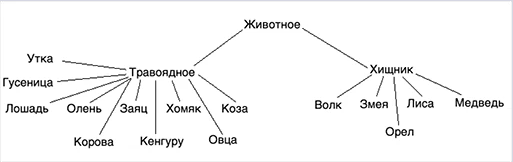

Bogdanov Mikhail project Реализация приложения Остров v1.0

## Задача

Твоя задача — запрограммировать модель острова с изменяемыми параметрами, состоящую из массива локаций (например, 100х20 клеток). Локации будут заполнены растительностью и животными. Животные могут:

- есть растения и/или других животных (если в их локации есть подходящая еда),
- передвигаться (в соседние локации),
- размножаться (при наличии пары в их локации),
- умирать от голода или быть съеденными.

## ООП
Создавая разнообразие животных, нужно по максимуму использовать ООП: все виды будут происходить от одного абстрактного класса Animal, который будет содержать поведение, общее для всех животных. Если у конкретных животных будут особенности питания, размножения, передвижения и т. д., то для них нужно будет переопределить методы класса Animal.
Что нужно сделать:
1. Создай иерархию классов:
Хищник: Волк, Удав, Лиса, Медведь, Орел
Травоядные: Лошадь, Олень, Кролик, Мышь, Коза, Овца, Кабан, Буйвол, Утка, Гусеница
Растения

Задана вероятность с которой животное съедает "пищу", если они находятся на одной клетке. Давай посмотрим на ситуацию "волк ест кролика". В таблице число 60. Это означает, что волк может съесть кролика, если они на одной клетке, с вероятностью 60%. Нужно использовать многопоточный random.

2. У животного должны быть методы: покушать, размножиться, выбрать направление передвижения.

3. В классах травоядного и хищника можно реализовать метод покушать. Но обрати внимание, есть травоядное утка, которое ест гусеницу.

4. В конкретных классах того или иного вида можно дорабатывать все методы под особенности животного.

5. Должно быть создано минимум 10 видов травоядных и 5 видов хищников (описаны в п. 1).

Конечно, можно написать всю программу в одном потоке, используя только циклы. Но нам нужно практически поработать с многопоточностью, поэтому обязательно нужно использовать потоки и пулы потоков. Один scheduled пул — для запуска по расписанию задания роста растений, задания жизненного цикла животных, и задания вывода статистики по системе. Как вариант, можно выводить статистику в одном задании с растениями или животными. Внутри задания жизненного цикла животных можно использовать еще один пул потоков — обычный. Какие задачи отдавать на выполнение этому пулу — решай самостоятельно.

## Обязательная часть задания:
- Иерархия животных (ООП)
- Поведение животных
- Многопоточность
- Статистика по состоянию острова на каждом такте (в консоль)

## Опциональная часть задания:

- Вынести параметры в одно место, чтоб было удобно управлять “симуляцией”
- Графика вместо консольной статистики. Это может быть как псевдо-графика в консоли, так и JavaFX, Swing…
- Добавь другие факторы, которые могут влиять на симуляцию:
  - больше видов животных
  - разные виды растений
  - кастомное поведение для группы животных (к примеру, волки охотятся и передвигаются не по одному, а стаей)
  - рельеф на земле, в том числе река, которая препятствует передвижению некоторых животных

## О параметрах (если решишь делать)
Чтобы при запуске программы было удобно менять различные ее параметры (размер острова, максимально допустимое количество растений/животных в одной клетке, вероятность передвижения того или иного вида животных, количество приплода у различных видов и т. д.), нужно все эти параметры вынести куда-то, например, в отдельный класс. Должна быть возможность изменять следующие параметры:

- размер острова
- длительность такта симуляции
- количество животных каждого вида на старте симуляции
- условие остановки симуляции (например, умерли все животные)
- количество детенышей у каждого вида животных

## Юникод (если решишь делать псевдографику)
Для изображения животных можно использовать юникод символы: 🐃, 🐻, 🐎, 🦌, 🐗, 🐑, 🐐, 🐺, 🐍, 🦊, 🦅, 🐇, 🦆, 🐁, 🐛.

## Справка

1) Консольный вывод: каждая ячейка поля выводится в табличной форме с помощью разделителей, в ячейке указано 
максимальное количество существ каждого подвида (растения, хищники, травоядные соответственно), 
в начале указывается день симуляции, после таблицы идет общая статистика по животным;
2) Действия животных (размножиться, переместиться) атомарны (берется лок на ячейку для каждого 
действия из трех), действие поесть необходимо доработать;
3) Коллекция животных в ячейке в виде Map(String, Set<Biosphere>);
4) Сделаны все типы животных. Константы класса (вес одного животного, максимальное количество животных этого вида 
на одной клетке, скорость перемещения, сколько килограммов пищи нужно животному для полного насыщения) вбиты 
непосредственно в конструктор каждого класса, получение всех возможных видов животных через Reflection API.

## TODO List

- Исправить метод eat(), разобраться почему возникают "сломанные" животные (возможно это также связано с перемещением
животных);
- Сделать конфигурацию из файла;
- Сделать оконный вывод;
- Сделать завершение симуляции через Callable/Future;
- Оптимизировать некоторые методы, работающие с коллекциями, вынести функции из циклов в переменные и т.д.;
- Возможно пересмотреть тип коллекции, в которой хранится список животных.